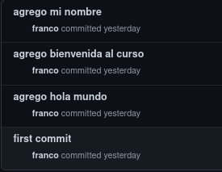

<table>
    <theader>
        <tr>
            <td></td>
            <th>
                UNIVERSIDAD NACIONAL DE SAN AGUSTIN 
                FACULTAD DE INGENIERÍA DE PRODUCCIÓN Y SERVICIOS 
                ESCUELA PROFESIONAL DE INGENIERÍA DE SISTEMAS
            </th>
            <td></td>
        </tr>
    </theader>
    <tbody>
        <tr><td colspan="3">Formato: Guía de Práctica de Laboratorio / Talleres / Centros de Simulación</td></tr>
        <tr><td>Aprobación:  2022/03/01</td><td>Código: GUIA-PRLB-001</td><td>Página: 1</td></tr>
    </tbody>
</table>

INFORME DE LABORATORIO 
(formato estudiante)

<table>
<theader>
<tr><th colspan="6">INFORMACIÓN BÁSICA</th></tr>
</theader>
<tbody>
<tr><td>ASIGNATURA:</td><td colspan="5">Estructura de Datos y Algoritmos</td></tr>
<tr><td>TÍTULO DE LA PRÁCTICA:</td><td colspan="5">Revisión de elementos de programación (Parte I)</td></tr>
<tr>
<td>NÚMERO DE PRÁCTICA:</td><td>01</td><td>AÑO LECTIVO:</td><td>2022 A</td><td>NRO. SEMESTRE:</td><td>III</td>
</tr>
<tr>
<td>FECHA DE PRESENTACIÓN:</td><td></td><td>HORA DE PRESENTACIÓN:</td><td colspan="3"></td>
</tr>
<tr><td colspan="3">Estudiante:
<ul>
<li>Franco Cárdenas Martinez - fcardenasm@unsa.edu.pe</li>
</ul>
</td>
<td>NOTA:</td><td colspan="2"></td>
</<tr>
<tr><td colspan="6">DOCENTE(s):
<ul>
<li>Richart Smith Escobedo Quispe - rescobedoq@unsa.edu.pe</li>
</ul>
</td>
</<tr>
</tbody>
</table>

<table>
<theader>
<tr><th>Solución y resultados</th></tr>
</theader>
<tbody>
<tr><td><b>I. SOLUCIÓN DE EJERCICIOS/PROBLEMAS</b>
<tr><td>Trabajo individual:
Crear un repositorio personal y desarrollar el ejercicio resuelto en clase, con almenos 3 commits.  

</td></tr>

</td></tr>
<tr><td><b>II. SOLUCIÓN DEL CUESTIONARIO</b>
    <pre><ul>
        <li>¿Por qué Git y GitHub son herramientas importantes para el curso?</li>
Estas herramientas nos permiten tener varias versiones del trabajo que hagamos además 
de poder documentar nuestro pensamiento y tener un backup en caso se pierda el codigo 
guardado en nuestra máquina local. Además, nos permite realizar trabajo en equipo 
usando distintas ramas lo cual es fundamental en la vida de un desarrollador.
        <li>¿Qué conductas éticas deberían promocionarse cuando se usa un Sistema de
Control de Versiones?</li>
Si bien git nos permite colaborar en equipo cuando  trabajamos en un proyecto, 
puede ocurrir la situación donde algunos no aporten al código mientras hay un
avance, por eso se debe promover el avance mutuo, también, el mejoramiento del
proyecto, es decir si se repartieron clases o partes del proyecto y ya terminado 
se ve que hay código óptimo para lo que ya existe, se debe colaborar dando 
sugerencias puesto que github promueve el avance del equipo, no de uno solo.
        <li>¿Qué son los entándares de codificación?</li>
Son las buenas prácticas o un conjunto de normas no formales, que han sido
sugeridas por diversas comunidades de desarrolladores a lo largo del tiempo.
Cuando estás son aplicadas de una manera correcta puede mejorar la calidad del 
código en el que se implementó.
    <ul>                                                                                         
    

    </td></tr>
<tr><td><b>III. CONCLUSIONES</b></td></tr>
<tr><td>Mi conclucion sobre este trabajo individual es que en general este fue muy instructivo, ya que me ayudo a recordar algunos conceptos de git en cuanto a su uso e importancia,ademas me parecio una exelente manera de empezar el curso, ya que git nos sera util durante toda la profesion.
</td></tr>
</tbody>
</table>

<table>
<theader>
<tr><th><b>RETROALIMENTACIÓN GENERAL</b>
    </th></tr>
</theader>
<tbody>
<tr><td>
    <pre>                                                                                          </pre>
    </td></tr>
</tbody>
</table>
    

    

<b>REFERENCIAS Y BIBLIOGRAFÍA</b>

<ul>
    <li>https://git-scm.com/book/es/v2</li>
    <li>https://guides.github.com/</li>
    <li>https://www.w3schools.com/java/default.asp</li>
</ul>
